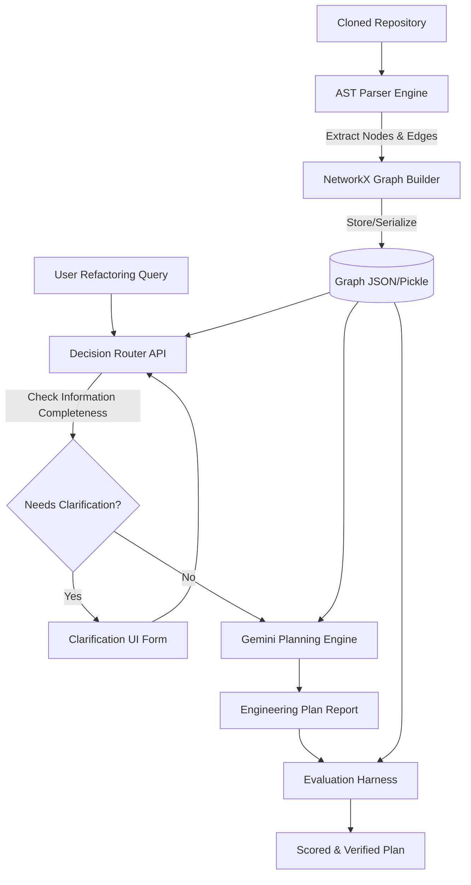

# Design Document — RepoScope

## Problem Statement

When engineers propose complex structural refactorings—such as replacing databases, extraction of services, or refactoring security middlewares—traditional AI assistants struggle. The primary reasons include:
1. **Context Fragmentation**: codebases are too large to fit entirely into context windows, leading to loss of context.
2. **Semantic Gaps**: Vector search/RAG retrievals fail to capture topological relationships (e.g., transitively dependent functions, circular imports, execution call chains).
3. **Overconfidence & Hallucinations**: LLMs tend to generate incomplete steps or fail to recognize downstream effects.

---

## Core Philosophy

RepoScope addresses these problems through **Topological and Structured Context Partitioning**:
- **Separate Codebase Extraction from LLM Reasoning**: Statically build a high-fidelity Knowledge Graph using deterministic parsers. No AI is used for indexing.
- **Topological Summarization**: Instead of feeding thousands of lines of raw code to Gemini, we feed it a serialized structural graph representing nodes (files, routes, functions) and edges (calls, imports). Gemini reasons about the *architecture*, not the low-level string patterns.
- **Dynamic Human-in-the-Loop Clarification**: Real-world planning depends heavily on business constraints (e.g., zero downtime, historical data migration). RepoScope identifies when it lacks these parameters and explicitly prompts the engineer before executing the planner.

---

## Architecture Diagram

---

## Trade-offs and Alternatives Considered

### Alternative A: Vector Search (RAG)
* **Cons**: Fails to answer "What functions will break if I modify `payments.py`?" because semantic embeddings don't encode transitive dependencies.
* **Why Graph wins**: NetworkX allows us to calculate shortest paths, ancestors, descendants, and reachability deterministically.

### Alternative B: Multi-Agent CrewAI/LangGraph Orchestration
* **Cons**: Adds high latency, prompt cost, and non-deterministic behavior for planning.
* **Why Single Agent wins**: The routing and evaluation check loops are simple enough that a structured single agent combined with deterministic graph logic is more reliable and easier to audit.
